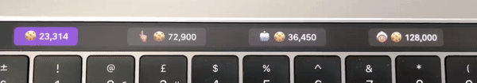
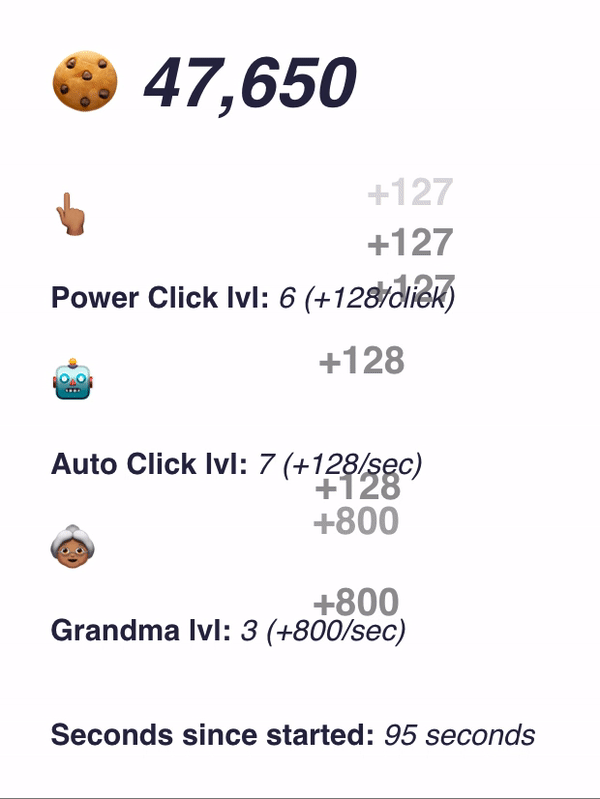

# touchbar-cookieclick
An Electron app Cookie Clicker inspired project for MacBook Pro's TouchBar.



## Prerequisites
* Latest version of Node.js (at least 6.x.x)
* MacBook Pro laptop with TouchBar


### How to Install
```
npm install
```
### How to Run
```
npm start
```




Excuse the poorly written code, this was just a fun little side project.
Feel free to play around with the js to create something cool :-)


Thanks to https://github.com/pahund/electron-touch-bar (Patrick Hund) for the basics.
